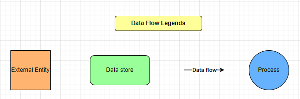
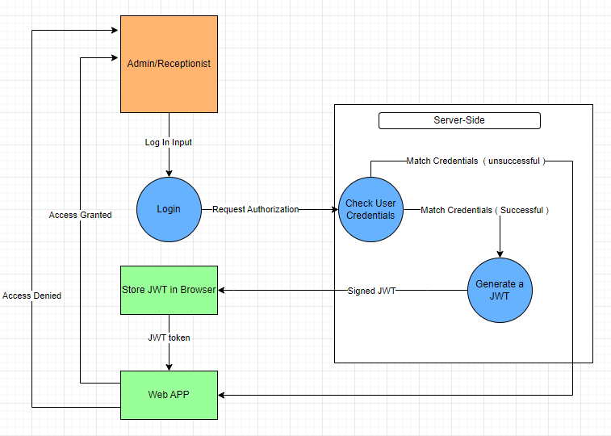
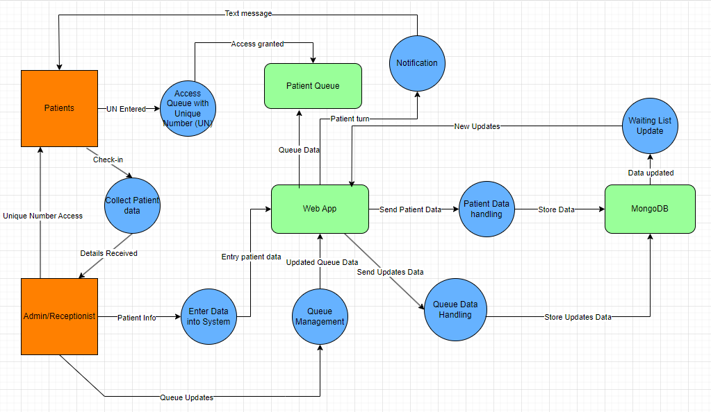
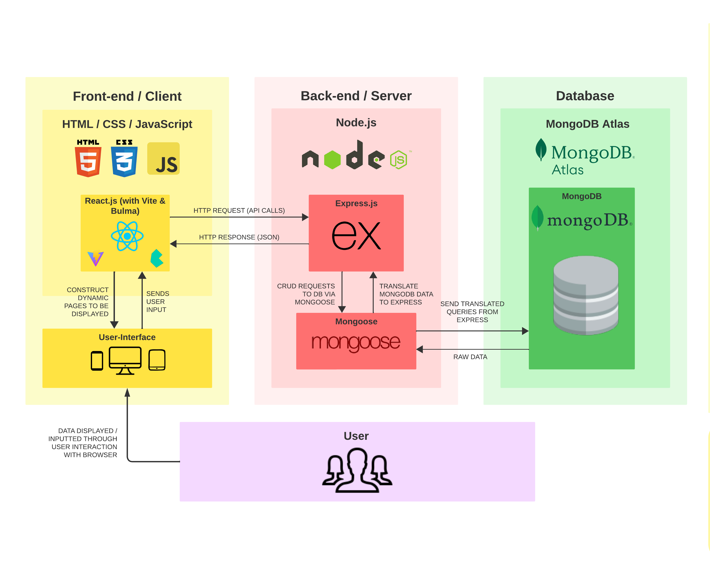
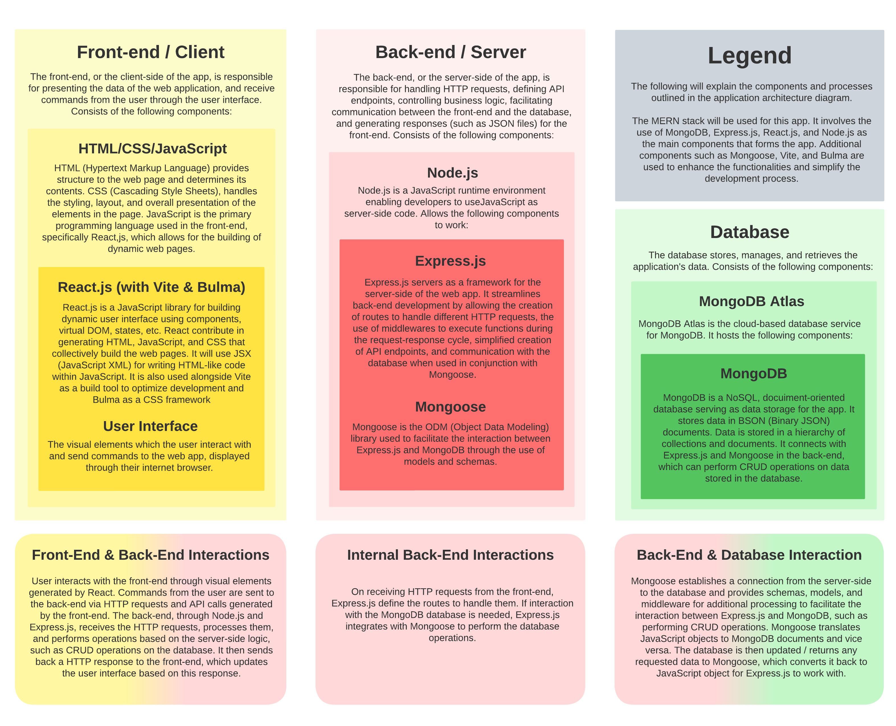

# T3A2

### Table of Contents:
- [R1 - Website Description](#r1---website-description)
- [R2 - Dataflow Diagram](#r2---dataflow-diagram)
- [R3 - Application Architecture Diagram](#r3---application-architecture-diagram)
- [R4 - User Stories](#r4---user-stories)
- [R5 - Wireframes](#r5---wireframes)
- [R6 - Trello Board](#r6---trello-board)

___

### R1 - Website Description

#### Overview
In the dynamic landscape of healthcare, general practitioners (GPs) operating on a walk-in basis encounter the challenge of managing patient queues efficiently, which often results in prolonged wait times and negatively affects patient satisfaction. Recognising this gap, our project introduces a sophisticated patient queue monitoring app designed to revolutionise the walk-in clinic experience for both patients and healthcare providers.
 
#### Purpose
The app aims to mitigate the challenges associated with walk-in clinic visits by offering real-time updates on queue status and estimated wait times. This innovative solution not only enhances patient satisfaction by providing clarity and convenience but also empowers clinic staff with effective tools to manage patient flow, thereby optimising operational efficiency and demonstrating a commitment to excellence in patient care.
 
#### Key Features
- Real-Time Queue Visibility: Patients can view their position in the queue and receive accurate estimates of their wait times, enabling them to manage their schedules more effectively.

- Patient Notifications: Utilising timely alerts, the app notifies patients as their appointment approaches, minimising the need for physical waiting and enhancing the overall clinic experience.
- Efficient Queue Management: A user-friendly dashboard allows clinic staff to manage the patient queue with ease, facilitating the addition, removal, and reordering of patients as required to accommodate real-time needs.
- Data-Driven Insights (Nice to Have): The app provides analytical tools for clinics to examine historical data on patient flow and wait times, supporting strategic decisions about resource allocation and operational improvements.
- Remote Queue Registration (Nice to Have): This feature enables patients to join the queue remotely, further reducing wait times and streamlining clinic visits.
 
#### Target Audience
##### Patients Seeking Convenience in Healthcare Access
- Patients Planning Visits: Individuals who need to balance their daily schedules with a visit to the GP can use the app to view real-time queue statuses. This feature is especially beneficial for those who cannot afford to take extended time off work or have caregiving responsibilities. By checking the queue condition before leaving home, patients can make informed decisions about when to head to the clinic, thereby reducing unnecessary travel and wait times.

- Individuals Preferring Remote Queue Joining: The app caters to those who prefer to minimise time spent in crowded waiting rooms, particularly during flu seasons or pandemics. By allowing patients to join the queue remotely, the app not only improves the patient's comfort but also enhances public health safety by reducing the potential for disease transmission in waiting areas.

- Patients Needing Flexibility: For individuals who need the flexibility to step out if the wait is long or have errands to run nearby, the app provides the freedom to leave the clinic area without losing their spot in the queue. They can monitor their progress in the queue through their mobile device and return to the clinic when their turn is approaching.

#### GP Clinic Staff and Administrators
- Clinic administrators looking to improve operational efficiency: The app aids administrators in managing patient flow more effectively, allowing for better allocation of staff and resources. By analysing patterns in patient visits and wait times, administrators can make data-driven decisions to improve service delivery.

- Medical Staff Seeking to Enhance Patient Satisfaction: For medical staff, the app provides tools to manage the patient queue transparently and communicate effectively with patients about wait times. This transparency and communication can significantly improve patient satisfaction and trust in the clinic's services.

- Healthcare Providers Focused on Safety: In scenarios requiring social distancing or minimising patient contact, the app offers a solution to keep patients informed and engaged remotely, thereby contributing to a safer healthcare environment.

#### Tech Stack
#### MongoDB
MongoDB is a scalable, NoSQL database designed for modern applications. It stores data in flexible, JSON-like documents, allowing for varied data structures and quick adaptation to changes. It's ideal for projects requiring efficient management of large volumes of data.
 
#### Express.js
Express.js is a lightweight Node.js framework for building web and mobile applications. It simplifies the development of server-side applications with its robust routing and middleware capabilities, making it perfect for creating RESTful APIs that interact with React frontends.
 
#### React
React is a JavaScript library for building dynamic user interfaces. Its component-based approach facilitates the development of reusable UI elements, enhancing the application's maintainability and performance, especially for interactive, single-page applications.
 
#### Node.js
Node.js is a JavaScript runtime that enables server-side scripting with JavaScript. It's known for its event-driven, non-blocking I/O model, which makes it suitable for building scalable and efficient network applications, including web servers and real-time applications.

### Additional Libraries and Tools
#### Mongoose
Mongoose is an Object Data Modelling (ODM) library for MongoDB and Node.js, used to manage relationships between data and facilitate the connection between the server-side of an app (in this case, Express.js) and MongoDB. It translates data represented by MongoDB into JavaScript objects that Express.js can work with, and vice versa.

#### Vite
Vite is a platform-agnostic build tool used as a development environment to streamline the development process of web apps. In this case, its use complements React.js. Some key features include a built-in development server supporting hot module replacement (HMR) allowing changes in the code to be reflected on the browser in real-time, use of native ES modules to compile code spontaneously eliminating the need for a traditional bundler, and a build command that bundles the app code with Rollup for performance improvements.

#### Jest & Supertest
Jest is a JavaScript testing framework, and Supertest is a testing library for testing HTTP requests and APIs in Node.js applications. These two are used together to generate automated tests for both the front-end and back-end functionalities of the app.

#### Netlify, Render, MongoDB Atlas
Netlify is used to deploy the app’s front-end, while Render is used to deploy the app’s back-end. MongoDB Atlas is the cloud database service used to host the app’s MongoDB database.

#### Summary
This patient queue monitoring app represents a strategic fusion of technology and healthcare, aimed at improving the efficiency of GP clinics and enriching the patient care experience. Through its innovative features and thoughtful design, the app stands as a testament to our commitment to technological excellence and user-centric development. As we present this project to prospective employers, we are confident in its potential to showcase our technical acumen, problem-solving abilities, and dedication to making a positive impact in the healthcare sector.

___

### R2 - Dataflow Diagram

#### Legend

#### Login

#### Application

___

### R3 - Application Architecture Diagram

___

### R4 - User Stories

User stories are informal descriptions of app features from the perspective of the end user. They articulate how our web app will provide value to the customer.
User stories divided in two categories:
1. Patients
2. Receptionist (Admin)

User stories
1. Patients:
- As a patient, I want to easily check into the GP’s queue upon arrival, so I can join the queue efficiently when I check-in.
- As a patient, I want to know an estimated wait time after joining the queue, so I can plan my time accordingly and avoid unnecessary waiting in the waiting room.
- As a patient, I want to  get access to real-time updates about my position in the queue, so I can anticipate when it's my turn to see the doctor.
- As a patient, I want to receive  a notification when my turn is approaching, so I can be prepared to see the doctor promptly.
- As a patient, I want to provide feedback about my experience through the app, so I can share my thoughts and suggestions for improvement.
- As a patient, I want to be able to join the queue remotely, so I can save time by not needing to physically be present at the clinic until closer to my appointment time.
 
2. Receptionist (admin):
- As a receptionist, I want to easily add walk-in patients to the queue, so they can be seen by the doctor in the order they arrive.
- As a receptionist, I want to view and manage the patient queue in real-time, so I can efficiently organize and prioritize patient appointments.
- As a receptionist, I want to update the status of patients in the queue, so patients are informed about their current position and status.
- As a receptionist, I want to generate reports and analytics about patient queue statistics, so I can analyse performance and identify areas for improvement.
- As a receptionist, I want to have a user-friendly interface on the Web app, so I can navigate and use its features intuitively without any difficulty.

___

### R5 - Wireframes

___

### R6 - Trelo Board

